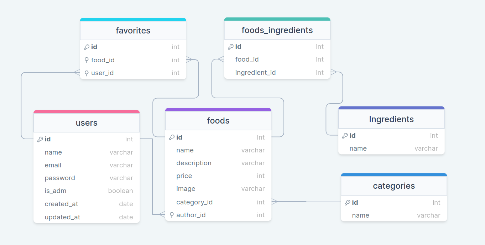

<h1 id="top">API - Food Explorer</h1>

<p>Essa API foi criada para o desafio final do curso Explorer da Rocketseat</p>
<div class="menu" style="display:flex; gap:10px;">
  <label for="#doc"><a href="#doc">Documentação</a></label>
  <label for="#Insomnia"><a href="#Insomnia">Insomnia</a></label>
  <label for="#user"><a href="#user">User</a></label>
  <label for="#sessions"><a href="#sessions">Sessions</a></label>
  <label for="#category"><a href="#category">Category</a></label>
  <label for="#foods"><a href="#foods">Foods</a></label>
  <label for="#favorite"><a href="#favorite">Favorite</a></label>
  <label for="#ingredients"><a href="#ingredients">Ingredients</a></label>
</div>

<h2>Diagrama das tabelas do banco de dados</h2>


<h2 id="doc">Documentação</h2>

<h3> - Necessário:</h3>
<p>Para conseguir rodar o projeto na sua máquina é necessário ter o <a href="https://git-scm.com/">GIT</a> e o <a href="https://nodejs.org/en">NODE.JS</a> instalado (verifique a versão de ambos e, se for preciso, atualize para a ultima versão)</p>

<h3> - clonado o repositório:</h3>

<p>Primeiro passo é clonar o código para sua máquina, podemos fazer isso utilizando o git clone, basta clicar no botão "code" e escolher a forma que deseja clonar, https ou <a href="https://docs.github.com/pt/authentication/connecting-to-github-with-ssh/generating-a-new-ssh-key-and-adding-it-to-the-ssh-agent">ssh</a></p>


<p>Com o link copiado, abra seu terminal na pasta que deseja colocar o projeto e execute git clone</p>

```
git clone https://github.com/gabriel-vitebo/api-food-explorer.git
```

<p>Depois de termina de clonar, no seu editor de código, vc já deve conseguir visualizar a pasta com os conteúdos dentro</p>


<h3> - Instalando as dependências:</h3>

<p>Agora, com o projeto já clonado, vamos instalar todas as dependências que o projeto precisa para rodar, primeiro, verifique se você está dentro da pasta do projeto,se executar o npm install fora da pasta, não irá funcionar, agora vamos utilizar o npm install</p>

```
npm install
```

<p>Depois de instalar todas as dependências, irá aparecer uma pasta chamada "node_modules"</p>

<h3> - Criando as migrates:</h3>
<p>Agora precisamos criar o banco de dados antes de testar a API, para isso, podemos executar:</p>

```
npm run migrate
```

<p>Esse comando vai rodas todas as migrates, criar todas as tabelas do banco de dados, nesse projeto vamos utilizar o <a href="https://www.sqlite.org/index.html">SQLite</a> com o <a href="https://knexjs.org/">knex</a></p>
<p>Depois de executar o comando, dentro da pasta database vai ter um arquivo chamado database.db</p>
<p>Se você já tiver dado o comando "npm run dev" para rodar o projeto,as migrates não vao ser criadas, para gerar as migrates, basta fecha o servidor ou abri uma janela nova no terminal e executar o comando</p>

<h3> - Visualizando o banco de dados</h3>

<p>Para visualizar as tabelas do banco de dados,vamos precisar usar um SGBD (Sistema Gerenciador de Banco de Dados)</p>
<p>Eu vou utilizar o <a href="https://www.beekeeperstudio.io/">Beekeeper Studio</a>, porém, fique livre para utilizar o que achar melhor</p>
<p>Depois de instalar o Beekeeper, vamos nos conectar ao banco de dados</p>

- Connection Type ou Tipo de conexão:
  Selecione a opção "SQLite"

- Database File:
  Clique em "Choose File" ou "Escolher arquivo",entre na pasta onde você clonou o repositório e vá até a pasta "src", depois entre na pasta "database" do projeto, e selecione o arquivo "database.db"

- Agora é so clicar em "connect" ou "conectar" e pronto, estamos conectados com o banco de dados

<p>Agora podemos visualizar todas as tabelas presentes no banco de dados e ja podemos testar a API</p>


<h3> - Rodando o projeto:</h3>

<p>agora podemos rodar o projeto utilizando</p>

```
npm run dev
```

<p>No seu terminal deverá exibir a mensagem</p>

```
server is running on Port 3333
```

<p>Isso significa que o projeto está rodando com sucesso na sua máquina</p>

<h2>Testando a API</h2>

<h3 id="Insomnia" > - Insomnia</h3>
<p>Para testar os métodos da API eu utilizo uma ferramenta chamada <a href="https://insomnia.rest/">Insomnia</a>, porém existe outras ferramentas para testar os métodos HTTP, fique livre para utilizar o que for melhor para você</p>
<p>Se for preciso, vou deixar abaixo algumas dicas que você pode fazer no insomnia para deixar o projeto mais organizado</p>

<ul>
  <li>Crie um ambiente, nesse ambiente você pode deixar alguns valores padrão, como a base url, que nesse projeto vai ser

    ```
    localhost:3333
    ```

  </li>
  
  <li>
    Crie pastas para cada um dos controles, e dentro dessas pastas, você consegue organizar por todos os métodos que esse controle utiliza
  </li>
  
  <li>
    Dentro de cada pasta, você consegue criar um ambiente para aquela pasta, assim, é mais pratico porque não precisa digitar o endereço sempre que for usa, basta usar a variável
  </li>
  
  <li>
    Dentro do ambiente base, você pode deixar salvo como padrão também, o token de autentificação, é muito mais produtivo, caso contrario, você tera que definir o token de autentificação em cada rota usar e precisar do token
  </li>
  
  <li>Abaixo está as informações para configurar o token</li>
  
</ul>

<h2 id="user">User</h2>

<p>No controle de usuário, temos apenas o endpoint de criar, usamos apenas o método POST</p>

<h3> - Cadastrando usuário</h3>

<p>para cadastrar o usuário, crie um arquivo HTTP request com o método POST com o endereço abaixo ,esse arquivo devera ser um JSON com um objeto contendo as informações em ray </p>

```
localhost:3333/users
```

```JSON
{
  "name": "string",
  "email": "string@email.com",
  "password": "string",
  "isAdm": true false,
}
```

<b>IMPORTANTE</b>

<ul>
  <li>password deverá ter 6 caracteres ou mais, caso contrario, ocorrerá um erro</li>
  <li>Se o "isAdm" for "false" você não vai conseguir criar, atualizar e nem deletar os pratos nessa conta,porque só os ADM tem acesso a isso</li>
  <li>Usuário administrativo só é possível ser criado aqui pelo backend</li>
</ul>

<h2 id="sessions">Sessions</h2>

<p>No controle de sessions, temos apenas o endpoint de criar, usamos apenas o método POST</p>

<h3> - Autentificando o usuário</h3>
<p>Agora para autentificar o usuário, vamos acessar o endereço</p>

```
localhost:3333/sessions
```

<p>no insomnia, vamos criar outro arquivo HTTP request chamada 'sessions' batendo no endereço acima,o arquivo deve conter um JSON com um objeto que contem as informações do usuário em ray </p>

```JSON
{
  "email": "string@email.com",
  "password": "string"
}
```

<p>A resposta será as informações do usuário e o token de acesso</p>

<h2 id="category">Category</h2>
<p>No controle de categorias, temos 5 endpoint</p>
<p> Create, Delete, Index, Show, GetAll </p>
<p>Para usar qualquer método de category, é preciso está autenticado, por isso, vá em "auth" e escolha a opção de "Bearer" e no valor, coloque o valor do token </p>
<p>o valor do token você pode visualizar na sessions, quando você da um POST, a resposta retorna algumas informações sobre o usuário, entre elas, o token. A desvantagem de usar o token assim, é que, quando o token espirar e mudar, você vai precisar mudar o valor manualmente, por isso, recomendo o jeito abaixo (A maneira que mencionei abaixo é usado no insomnia, eu não sei como fazer em outra ferramenta)</p>
<p>Outro jeito de pegar o valor do token é naquele ambiente base que mencionei lá em cima, para usar, é só colocar o nome da variável no valor, nesse caso, quando o token expirar e criar um novo,a variável atualiza sozinho</p>

<p>caso você não tenha a variável, você consegue criar na hora, em value basta digitar 'body attribute' e clicar na função que irá aparecer, e fazer as configurações que deixei lá em cima</p>


<b>IMPORTANTE</b>

<p>Em qualquer lugar da aplicação que o usuário precisar ser autentificado, o processo é o mesmo</p>

<p>Com o usuário já autenticado, vamos seguir!</p>

<h3> - Criando uma categoria</h3>

<p>Para criar uma categoria nova, vamos acessar o endereço</p>

```
localhost:3333/categories
```

<p>Vamos criar outro arquivo HTTPS request com o nome de 'create', utilizando o método POST, recebendo um JSON com objeto contendo a informação em ray</p>

```JSON
{
  "name":"string"
}
```

<h3> - Buscando os pratos separados por categorias </h3>
<p>Vamos criar outro arquivo HTTPS request com o nome de 'index', utilizando o método GET, Aqui vamos acessar apenas /categories </p>

```
http://localhost:3333/categories
```

<p>A resposta vai ser, um objeto contendo todas a informação dos pratos relacionados a cada categoria cadastrada</p>

<h3> - Buscando a categoria pelo parâmetro</h3>
<p>Vamos criar um arquivo HTTPS request com o nome de 'show', utilizando o método GET, Aqui vamos passar o ID da categoria no parâmetro </p>

```
localhost:3333/categories/:id
```

<p>A resposta vai ser todos os pratos cadastrados relacionando a essa categoria especifica</p>

<h3> - Pegando todas as categorias</h3>

<p>Vamos criar um arquivo HTTPS request com o nome de 'getAll', utilizando o método GET, e vamos apenas colocar /all no parâmetro </p>

```
localhost:3333/categories/all
```

<p>A resposta deve ser a informação de todas as categorias cadastradas</p>

<h3> - Deletando categoria</h3>
<p>Vamos criar um arquivo HTTPS request com o nome de 'Delete', utilizando o método DELETE, e vamos apenas colocar o id da categoria que deseja deletar no parâmetro </p>

```
localhost:3333/categories/:id
```

<h2 id="foods">Foods</h2>
<p>No controle de foods, temos 5 endpoint</p>
<p> Create, showDetails, Delete, index, update </p>
<b>IMPORTANTE</b>
<p>Para fazer qualquer requisição no controle de foods, é necessário está autentificado</p>

<h3> - Criando um prato novo</h3>

<p>Para criar um prato novo, vamos acessar o endereço</p>

```
localhost:3333/foods
```

<p>Vamos criar outro arquivo HTTPS request com o nome de 'create', utilizando o método POST, recebendo um JSON com objeto contendo as informações em multiPart </p>

```Multipart
    name: string,
	description: string,
	price: number,
	image: file,
	ingredients: ["string1", "string2"],
	categoryId: string
```

<b>IMPORTANTE</b>

<p>A imagem deve ser colocada em um arquivo file, se colocar o nome da imagem em uma string não irá funcionar, no insomnia, no lugar de JSON, podemos colocar "Multipart", colocando todos os campos com os devidos valores, e em imagem selecionar "file" e por esse input escolher a imagem que deseja enviar (no Multipart não é necessário colocar "" nos valores igual em JSON, caso coloque "" em categoryId vai dar null)</p>

<ul>
  <li>Todos os campos são obrigatórios</li>
  <li>categoryId é so conferir na tabela de categorias pela categoria que deseja e pegar o id</li>
  <li>No preço não poder utilizar virgula ",", deverá ser apenas por ponto "."
  </li>
  <li>os ingredientes deve colocado dentro de um array(no Multipart o valor dentro do array precisa usar "", ["exemplo1", "exemplo2"])</li>
</ul>

<h3> - Mostrando o detalhe do prato </h3>

<p>Vamos criar outro arquivo HTTPS request com o nome de 'showDetails', utilizando o método GET, e vamos colocar o ID do prato como parâmetro </p>

```
localhost:3333/foods/:id
```

<p>A resposta vai ser as informações do prato buscado</p>

<h3> -Deletando o prato </h3>

<p>Vamos criar outro arquivo HTTPS request com o nome de 'Delete', utilizando o método DELETE, e vamos colocar o ID do prato como parâmetro </p>

```
localhost:3333/foods/:id
```

<p>Depois, pode conferir no banco de dados para garantir que deu tudo certo, e o prato foi excluído</p>

<h3> -Pesquisando o prato </h3>

<p>Vamos criar outro arquivo HTTPS request com o nome de 'index', utilizando o método GET, e vamos utilizar a query usando "name" com o "value" que deseja buscar </p>

```
http://localhost:3333/foods?name=sushi
```

<p>A resposta vai ser a informação de todos os pratos e ingredientes que dão match com o nome pesquisado, caso não houver, retornará um array vazio</p>

<h3> -Atualizando o prato </h3>

<p>Vamos criar outro arquivo HTTPS request com o nome de 'Update', utilizando o método PUT, e vamos colocar o ID do prato como parâmetro </p>

```
localhost:3333/foods/:id
```

<p>Aqui podemos utilizar do mesmo jeito que fizemos no Create, usando o Multiform,mudando os devidos valores que deseja atualizar, e na imagem colocando no arquivo file</p>

```Multipart
    name: string,
	description: string,
	price: number,
	image: file,
	ingredients: ["string1", "string2"],
	categoryId: string
```

<b>IMPORTANTE</b>

<p>Todos os campos deverá ser preenchido, mesmo que queira mudar apenas um campo, verifique se os outros campos estão preenchidos também</p>

<h2 id="favorite">Favorites</h2>
<p>No controle de favoritos, temos 3 endpoint</p>
<p> adding, Delete, Show </p>
<b>IMPORTANTE</b>
<p>Para fazer qualquer requisição no controle de favoritos, é necessário está autentificado</p>

<h3> - Adicionando aos favoritos</h3>

<p>Vamos criar outro arquivo HTTPS request com o nome de 'adding', utilizando o método POST, e no corpo da requisição, em ray, passando o ID do prato que deseja favoritar </p>

```
localhost:3333/favorites
```

```JSON
{
  "food_id": "string"
}
```

<h3> - Removendo dos favoritos </h3>

<p>Vamos criar outro arquivo HTTPS request com o nome de 'Delete', utilizando o método DELETE, e nos parâmetros coloque o ID do prato que deseja remover dos favoritos </p>

```
localhost:3333/favorites/:id
```

<h3> -Mostrando os favoritos </h3>

<p>Vamos criar outro arquivo HTTPS request com o nome de 'Show', utilizando o método GET </p>

```
localhost:3333/favorites
```

<p>A resposta vai ser os pratos favoritados do usuário que solicitou, não precisamos passar o ID do usuário em nenhum lugar porque conseguimos identificar o usuário pelo token de autentificação utilizado</p>

<h2 id="ingredients">Ingredients</h2>
<p>No controle de ingredients, temos 1 endpoint</p>
<p> index </p>
<b>IMPORTANTE</b>
<p>Para fazer qualquer requisição no controle de ingredients, é necessário está autentificado</p>

<h3> -Mostrando os ingredientes </h3>

<p>Vamos criar outro arquivo HTTPS request com o nome de 'index', utilizando o método GET, e basta da um request em</p>

```
localhost:3333/ingredients
```

<p>A resposta vai ser todos os ingredientes cadastrados no banco de dados</p>
